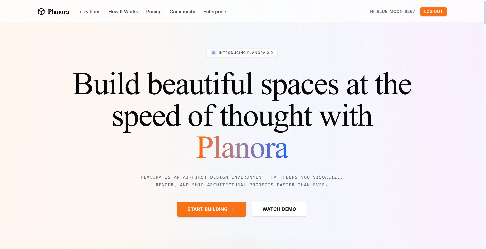
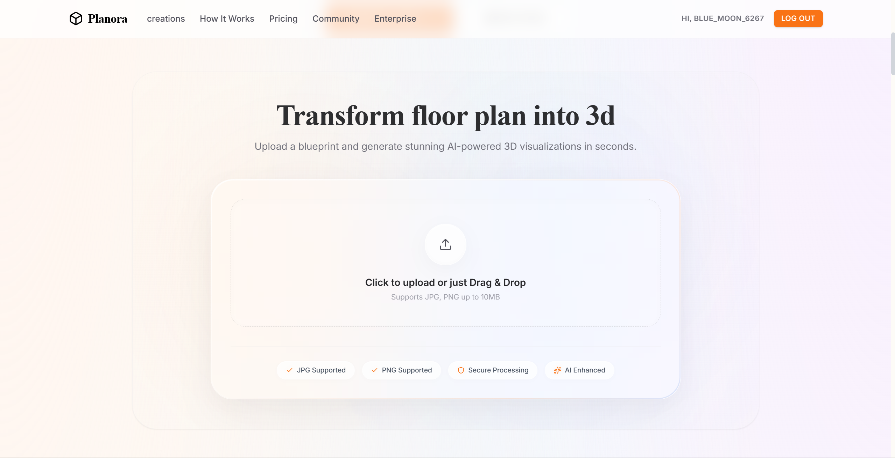

# 🏗️ Planora AI

### Transform 2D Floor Plans into Photorealistic Architectural Visualizations using AI.

Planora AI is an AI-powered architectural visualization platform that converts static 2D floor plans into realistic 3D architectural renders using state-of-the-art AI models. The platform combines modern frontend engineering, cloud infrastructure, serverless computing, and AI-powered image generation into a seamless user experience.

---




## ✨ Overview

Architects, interior designers, real estate professionals, and homeowners often struggle to visualize spaces from traditional 2D floor plans.

Planora AI solves this problem by transforming floor plans into photorealistic visualizations in seconds.

Upload a floor plan → Select a design style → Generate stunning AI renders → Share with the world.

---

## 🚀 Features

### 🎨 AI-Powered 2D → 3D Visualization

Convert static floor plans into realistic architectural renders using advanced AI models.

### 📸 Photorealistic Render Generation

Generate high-quality architectural visualizations with realistic:

- Furniture
- Lighting
- Materials
- Flooring
- Textures
- Interior Design Elements

### 🔄 Before & After Comparison

Interactive comparison slider to visualize transformations between:

- Original Floor Plan
- AI Generated Visualization

### 🗂️ Project Gallery

Manage all generated projects in a centralized workspace.

- Instant loading
- Persistent metadata
- Historical render tracking

### ☁️ Permanent Media Hosting

All uploaded assets and generated renders are stored permanently with public URLs.

### 🌍 Community Feed

Discover architectural creations from users around the globe.

- Share projects
- Explore designs
- Discover inspiration

### 🔐 Privacy Controls

Choose whether projects remain:

- Public
- Private

### 📦 Export & Download

Export generated renders for:

- Client Presentations
- Real Estate Marketing
- Interior Design Workflows
- Portfolio Showcases

---

# 🧠 AI Pipeline

Planora AI utilizes a multi-stage AI workflow.

## Step 1: Floor Plan Upload

User uploads:

- PNG
- JPG
- JPEG

## Step 2: Architectural Understanding

Vision models analyze:

- Room Layout
- Room Structure
- Floor Arrangement
- Spatial Relationships

## Step 3: Prompt Generation

AI generates optimized architectural prompts based on:

- Layout Analysis
- Design Style
- Visual Context

## Step 4: Image Generation

Advanced image generation models create:

- Interior Visualizations
- Architectural Concepts
- Photorealistic Renders

## Step 5: Storage & Delivery

Generated assets are:

- Stored permanently
- Assigned public URLs
- Indexed with metadata

---

# 🏛️ System Architecture

```text
                    ┌─────────────────────┐
                    │      User Upload    │
                    └──────────┬──────────┘
                               │
                               ▼
                    ┌─────────────────────┐
                    │ React Frontend      │
                    │ TypeScript + Vite   │
                    └──────────┬──────────┘
                               │
                               ▼
                    ┌─────────────────────┐
                    │ Puter Workers       │
                    │ Serverless Layer    │
                    └──────────┬──────────┘
                               │
         ┌─────────────────────┼─────────────────────┐
         ▼                     ▼                     ▼
 ┌──────────────┐     ┌──────────────┐     ┌──────────────┐
 │ Claude AI    │     │ Gemini AI    │     │ KV Storage   │
 └──────────────┘     └──────────────┘     └──────────────┘
         │                     │
         └──────────┬──────────┘
                    ▼
          ┌─────────────────────┐
          │ Render Generation   │
          └──────────┬──────────┘
                     ▼
          ┌─────────────────────┐
          │ Permanent Storage   │
          └──────────┬──────────┘
                     ▼
          ┌─────────────────────┐
          │ Community Feed      │
          └─────────────────────┘
```

---

# ⚙️ Tech Stack

## Frontend

- React
- TypeScript
- Vite
- Tailwind CSS

## Infrastructure

- Puter
- Puter Workers
- Puter KV Storage
- Permanent File Storage

## AI Models

- Claude
- Gemini

## Developer Tools

- CodeRabbit
- Junie

---

# 📂 Project Structure

```text
src
│
├── components
│   ├── ComparisonSlider
│   ├── RenderCard
│   ├── UploadZone
│   └── CommunityFeed
│
├── pages
│   ├── Home
│   ├── Generate
│   ├── Projects
│   └── Feed
│
├── hooks
│
├── services
│   ├── ai
│   ├── storage
│   └── workers
│
├── utils
│
├── types
│
└── assets
```

---

# 🔄 Render Workflow

```text
Upload Floor Plan
        │
        ▼
Analyze Structure
        │
        ▼
Generate Prompt
        │
        ▼
Generate Render
        │
        ▼
Store Metadata
        │
        ▼
Store Images
        │
        ▼
Display Results
```

---

# 📈 Scalability Design

Planora AI is designed around serverless infrastructure.

Benefits:

- Infinite horizontal scaling
- Low operational overhead
- Reduced infrastructure costs
- Global asset delivery
- Fast response times

---

# 🎯 Use Cases

### Architecture Firms

Generate quick visual concepts.

### Interior Designers

Visualize room transformations.

### Real Estate Companies

Create marketing-ready visual assets.

### Property Owners

Understand potential renovations.

### Students

Learn architectural visualization workflows.

---

# 🛣️ Future Roadmap

- AI Video Walkthroughs
- Interior Design Chat Assistant
- Real-Time Style Editing
- Collaborative Workspaces
- Design Templates Marketplace
- AI Cost Estimation
- Floor Plan Generation
- Multi-Agent Architecture Engine

---

# 💡 Key Engineering Highlights

- AI Orchestration
- Serverless Infrastructure
- Persistent Media Hosting
- Metadata Management
- Architectural Image Generation
- Global Content Feed
- Privacy Management
- Modern React Architecture
- Reusable Component System
- High Performance Rendering Pipeline

---

# 🌟 Why Planora AI?

Planora AI bridges the gap between technical architectural plans and human visualization.

Instead of imagining how a space might look, users can instantly see it.

Built with modern AI, cloud-native infrastructure, and scalable engineering principles, Planora AI demonstrates how artificial intelligence can transform architectural workflows.

---

## 📜 License

This project is licensed under the MIT License.

---

Built with ❤️ using React, TypeScript, Puter, Claude, and Gemini.
